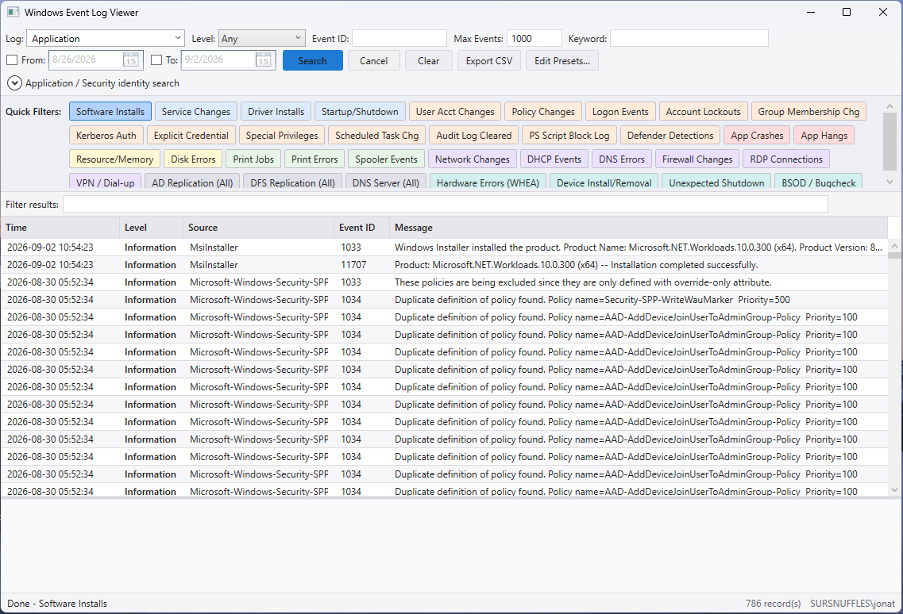
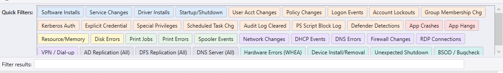
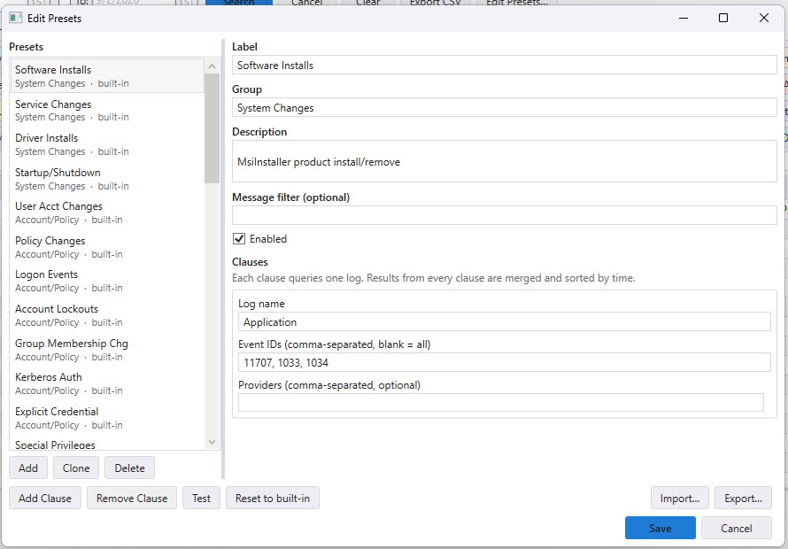
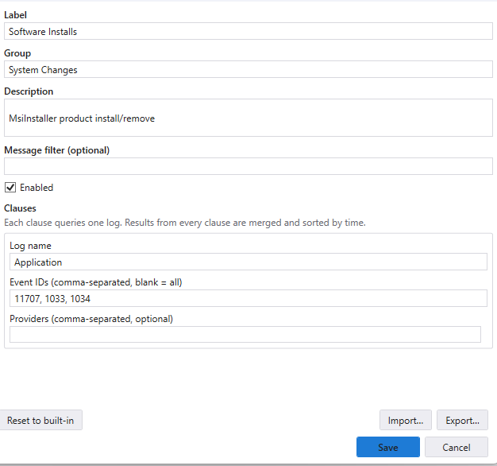
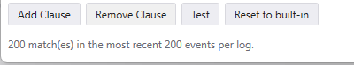
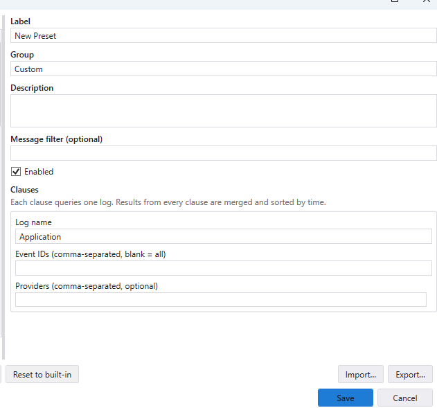

# Windows Event Log Viewer

A single-file Windows desktop app for browsing Windows Event Logs, with quick-filter presets for
common IT and security investigations, application-name search, and security-identity search by
user, host, or IP.

Built for remote support: one `EventLogViewer.exe`, about 400 KB, no installer and no
prerequisites. It targets .NET Framework 4.8, which ships in-box on Windows 10 1903+, Windows 11,
and Server 2019+, and it is designed to work correctly inside a **ScreenConnect Backstage**
session.



## Running

Download `EventLogViewer.exe` from [Releases](../../releases) and run it. That is the whole
install — copy the single file wherever you need it.

Right-click → *Run as Administrator* if you need the Security log (or any preset that reads it).

### In ScreenConnect Backstage

Copy the exe to the machine and run it from the Backstage command prompt:

```bat
C:\Windows\Temp\EventLogViewer.exe
```

Backstage runs processes as `NT AUTHORITY\SYSTEM` on a separate desktop, which changes a few
things. The app detects this and adapts:

| | Behaviour in Backstage |
|---|---|
| **Security log** | Works with no elevation prompt — the process is already SYSTEM. |
| **CSV export** | Skips the file dialog (unreliable on an alternate desktop) and writes to `%TEMP%\EventLogViewer\`, then copies the path to the clipboard. Retrieve it with ScreenConnect file transfer. |
| **Update link** | Copies the release URL instead of launching a browser as SYSTEM. |
| **Window size** | Sized from the actual desktop, so it fits a 1024×768 Backstage screen. |

The status bar shows which mode the app detected, e.g. `SYSTEM · Backstage desktop`, so you can
tell at a glance which behaviour is in effect.

### Command line

```
EventLogViewer.exe [--presets <path>] [--trace-bindings]

  --presets <path>   Load preset overrides from the given presets.json.
                     Defaults to presets.json beside the executable, if present.
  --trace-bindings   Write WPF data-binding warnings to bindings.log. Diagnostics only.
  --help             Show usage.
```

## Using the app

### Manual filters

| Field | What it does |
|---|---|
| **Log** | Log to query. Editable — type any log name, not just the listed ones. |
| **Level** | Any / Critical / Error / Warning / Information / Verbose. |
| **Event ID** | Comma-separated Event IDs, e.g. `7045,7036`. Blank for all. |
| **Max Events** | Cap on how many events are pulled back. |
| **Keyword** | Substring filter against the event message. Applies on top of a preset or either search below. |
| **From / To** | Optional date range (tick the box to enable). |

Press **Search**, or Enter, or F5. **Cancel** (or Escape) stops a running query — useful when a
50,000-event search on a busy server is taking longer than expected.

### Quick Filters

One-click presets, colour-coded by group — see the reference below. Clicking one sets the Log
field and runs immediately; the Keyword box, if filled in, still applies on top.

### Application search

Enter an application or product name (e.g. `Chrome`, `SQL Server`) and click **Find App Events**.
This finds every event provider whose name matches, queries every log those providers write to,
and also checks the Application log's generic crash/hang IDs (1000/1001/1002) in case the app's
crashes were logged under "Application Error" rather than its own provider name.

### Security identity search

Enter a **User**, **Host**, and/or **IP** — any combination, at least one — and click **Search
Security Events**. Searches a curated set of identity-relevant Security events (logon/logoff,
explicit-credential and special-privilege logons, account management, group membership changes,
lockouts, Kerberos) and keeps only rows matching every field you filled in. Needs Administrator,
or Backstage.

### Results

- Click a row to see its full message in the detail pane.
- **Filter results** narrows the rows already loaded, across Message, Source and Event ID, without
  re-querying.
- **Export CSV** writes what the filter currently shows.

## Presets

Presets are data, not code. The 36 built-in presets are embedded in the exe; an optional
`presets.json` beside it (or at `--presets <path>`) adds to, changes, or hides them.

You can edit them two ways: in the app with **Edit Presets…**, or by hand in `presets.json`.
Both write the same file.



### Editing presets in the app

Click **Edit Presets…** in the toolbar.



The list on the left shows every preset, including ones currently turned off, each labelled
`built-in` or `custom`. Selecting one opens it on the right.

**1. Edit the fields.** Label and group drive the button; group also picks its colour, and a group
you invent gets a colour of its own. Description becomes the button's tooltip — worth filling in
if the preset's Event IDs are shared with unrelated sources, so the next person knows why it is
scoped the way it is.

**2. Edit the clauses.** Each clause queries one log, with its own Event IDs and providers.



Leave **Event IDs** blank to match every event in the log, which is how the Active Directory
presets work. Use **Providers** when an Event ID is reused across unrelated sources — see the two
notes below.

**Add Clause** gives a preset a second log. Results from every clause are merged and sorted
together by time, which is how a preset spans more than one log — `Resource/Memory` and
`DNS Errors` both do. The [JSON example below](#presetsjson-format) shows the two-clause shape.

**3. Test it.** The **Test** button runs the preset exactly as edited and reports how many events
it matches on this machine. It is the fastest way to catch a wrong Event ID, and it will tell you
if the log does not exist here at all rather than just returning nothing.



**4. Save.** Writes `presets.json` beside the exe. If that location is not writable — running from
a temp copy or a read-only share — you are asked where to put it instead.

Only the differences are written, so the file stays small and reviewable in git, and a later fix
to a built-in preset still reaches you.

#### Adding your own

**Add** creates a new preset, ready to fill in; **Clone** copies the selected one, which is usually
the faster start. Either way it lands in the `Custom` group by default, and once saved it appears
in the Quick Filters strip alongside the built-ins with a colour of its own.



#### Turning a built-in off

**Delete** on a built-in turns it off rather than removing it — the definition is kept, so you can
re-enable it with the **Enabled** box, and a future fix to that preset is not permanently
discarded. Delete on a custom preset removes it outright.

#### Sharing a preset set across the team

**Export…** writes the current set to a file; **Import…** merges one in. Keep the exported
`presets.json` in your IT repo and drop it beside the exe when you push the tool to a machine —
that is the whole mechanism for a shared team preset set, with no server component involved.

### presets.json format

A preset file only needs the presets it changes — everything else keeps the built-in definition,
so a later fix to a built-in still reaches you.

```json
{
  "presets": [
    {
      "id": "custom.our-line-of-business-app",
      "group": "Custom",
      "label": "LOB App Errors",
      "description": "Errors from our line-of-business application",
      "clauses": [
        { "logName": "Application", "eventIds": [4001, 4002], "providerNames": ["AcmeLOB"] }
      ]
    },
    { "id": "printing.print-jobs", "disabled": true }
  ]
}
```

| Field | Meaning |
|---|---|
| `id` | Stable identity. Matching a built-in `id` **replaces** it; a new `id` **adds** a preset. Do not change an id once it is in use. |
| `group` | Controls the button colour and grouping. A new group gets its own colour automatically. |
| `label` | Button text. |
| `description` | Button tooltip. |
| `disabled` | `true` hides a built-in preset. The rest of its definition can be omitted. |
| `clauses` | One or more logs to query. Results are merged and sorted by time. |
| `clauses[].logName` | Log to query. Required. |
| `clauses[].eventIds` | Event IDs. Omit or leave empty for every event in the log. |
| `clauses[].providerNames` | Restricts to specific sources. Important when an Event ID is reused. |
| `messageFilter` | Substring applied to the message after the query runs. |

**Why `providerNames` matters:** Windows reuses small Event IDs across unrelated providers in the
same log — System-log ID `1` is used by dozens of sources. Without a provider scope, a preset on
ID 1 returns a flood of unrelated events.

**Why `messageFilter` exists:** some Event IDs are shared with no distinguishing provider at all.
Service Control Manager's 7031/7034 are emitted for *every* service on the machine, and only the
message text says which one, so the Spooler preset filters on the text.

> Note: a provider name containing an apostrophe cannot be expressed in an event log query — the
> log implements a subset of XPath with no `concat()`, and XPath has no escape inside a string
> literal. Such a name is applied as a post-query filter instead, which still gives correct
> results but reads more of the log to do it.

## Preset reference

Windows reuses small Event IDs across unrelated providers within the same log. Where that is a
real risk, presets below are scoped to a specific provider or post-filtered by message text —
shown in the "Scoped by" column. Presets without a note filter on log and Event ID alone.

<!-- PRESET-REFERENCE:START - generated by build\Generate-PresetDocs.ps1, do not edit by hand -->

### Account/Policy

| Preset | Log(s) | Event ID(s) | What it shows | Scoped by |
|---|---|---|---|---|
| User Acct Changes | Security | 4720, 4722, 4725, 4726, 4738 | Account created, enabled, disabled, deleted, modified |  |
| Policy Changes | Security | 4719, 4739 | System and domain audit policy changed |  |
| Logon Events | Security | 4624, 4625, 4634, 4647 | Successful/failed logon and logoff |  |
| Account Lockouts | Security | 4740 | User account locked out after failed logon attempts |  |
| Group Membership Chg | Security | 4728, 4729, 4732, 4733, 4756, 4757 | Members added/removed: global, local, universal security groups |  |
| Kerberos Auth | Security | 4768, 4769, 4771, 4776 | TGT/service-ticket requests, pre-auth failures, credential validation |  |
| Explicit Credential | Security | 4648 | Logon using explicit credentials (RunAs) - possible lateral movement |  |
| Special Privileges | Security | 4672 | Admin-equivalent logon - sensitive privileges assigned |  |
| Scheduled Task Chg | Security | 4698, 4699, 4700, 4701, 4702 | Scheduled task created, deleted, enabled, disabled, or updated |  |
| Audit Log Cleared | Security | 1102 | Security audit log was cleared - investigate immediately |  |
| PS Script Block Log | Microsoft-Windows-PowerShell/Operational | 4104 | Logged PowerShell script block text (requires Script Block Logging GPO) |  |
| Defender Detections | Microsoft-Windows-Windows Defender/Operational | 1116, 1117 | Malware detected / remediation action taken |  |

### Active Directory

| Preset | Log(s) | Event ID(s) | What it shows | Scoped by |
|---|---|---|---|---|
| AD Replication (All) | Directory Service | _all_ | All Directory Service log entries - replication/health issues (Domain Controllers only) |  |
| DFS Replication (All) | DFS Replication | _all_ | All DFSR entries - SYSVOL/DFS replication issues (Domain Controllers only) |  |
| DNS Server (All) | DNS Server | _all_ | All DNS Server role entries (Domain Controllers/DNS role only) |  |

### App Health

| Preset | Log(s) | Event ID(s) | What it shows | Scoped by |
|---|---|---|---|---|
| App Crashes | Application | 1000, 1002 | Application Error and Application Hang (WER) |  |
| App Hangs | Application | 1002, 1001 | Hang detection and Windows Error Reporting follow-up |  |

### Hardware

| Preset | Log(s) | Event ID(s) | What it shows | Scoped by |
|---|---|---|---|---|
| Hardware Errors (WHEA) | System | 1 | Fatal/corrected hardware errors via WHEA - ID 1 alone is one of the most-reused IDs in the System log, so this is scoped to the WHEA providers specifically | provider `Microsoft-Windows-WHEA-Logger`, `Microsoft-Windows-Kernel-WHEA` |
| Device Install/Removal | Microsoft-Windows-Kernel-PnP/Configuration | 400, 410, 420, 430 | Device driver install/removal lifecycle - tip: use Keyword box to filter by device type (e.g. "USB") |  |
| Unexpected Shutdown | System | 41 | Kernel-Power: system rebooted without a clean shutdown - often power/hardware related | provider `Microsoft-Windows-Kernel-Power` |
| BSOD / Bugcheck | System | 1001 | Windows Stop Error (blue screen) - bugcheck code and parameters | provider `Microsoft-Windows-WER-SystemErrorReporting` |

### Networking

| Preset | Log(s) | Event ID(s) | What it shows | Scoped by |
|---|---|---|---|---|
| Network Changes | System | 10000, 10001, 4000, 4001 | NIC connect/disconnect (NDIS) |  |
| DHCP Events | System | 1001, 1002, 1003 | DHCP lease obtained, renewed, or lost |  |
| DNS Errors | System<br>Application | 1014<br>4015 | DNS name resolution failure and DNS server errors |  |
| Firewall Changes | Security | 4946, 4947, 4950, 2004 | Firewall rule added, modified, or exception changed |  |
| RDP Connections | Microsoft-Windows-TerminalServices-RemoteConnectionManager/Operational | 261, 1149 | RDP session auth and successful connections |  |
| VPN / Dial-up | Application | 20227, 20226 | RAS/VPN connection success or failure |  |

### Printing

| Preset | Log(s) | Event ID(s) | What it shows | Scoped by |
|---|---|---|---|---|
| Print Jobs | Microsoft-Windows-PrintService/Operational | 307 | Document printed - job, user, printer, pages |  |
| Print Errors | Microsoft-Windows-PrintService/Operational | 372, 374, 375 | Spooler errors and failed print jobs |  |
| Spooler Events | System | 7031, 7034 | Print Spooler service crash or restart (IDs 7031/7034 are generic Service Control Manager events shared by every service, filtered here to Spooler by message text) | message contains "Spooler" |

### Resources

| Preset | Log(s) | Event ID(s) | What it shows | Scoped by |
|---|---|---|---|---|
| Resource/Memory | System<br>Application | 2004, 2019, 2020<br>1530 | Low memory / pool exhaustion / profile warnings |  |
| Disk Errors | System | 7, 11, 153 | Bad block, device I/O error, disk reset - IDs 7/11/153 are also reused by unrelated providers (e.g. Hyper-V networking, Kernel-Boot), so this is scoped to the disk drivers specifically | provider `disk`, `Microsoft-Windows-Disk` |

### System Changes

| Preset | Log(s) | Event ID(s) | What it shows | Scoped by |
|---|---|---|---|---|
| Software Installs | Application | 11707, 1033, 1034 | MsiInstaller product install/remove |  |
| Service Changes | System | 7045, 7036 | New service installed or state changed |  |
| Driver Installs | System | 7045 | Kernel/file system driver installed (ID 7045 is shared by every new service; filtered here to entries whose Service Type mentions "driver") | message contains "driver" |
| Startup/Shutdown | System | 6005, 6006, 1074, 6008 | Boot, clean shutdown, unexpected shutdown, restart reason |  |

<!-- PRESET-REFERENCE:END -->

Active Directory presets pull the entire log (bounded by Max Events), because replication, DFSR
and DNS-server event IDs vary too much to hardcode. On a machine without those logs they show
"0 records" and say so, rather than erroring.

## Building

Requires the [.NET SDK](https://dotnet.microsoft.com/download) (8.0 or later). Visual Studio is
not needed — the projects target .NET Framework 4.8 but build with the SDK alone.

```powershell
.\build\publish.ps1
```

Runs the tests and produces a single self-contained `dist\EventLogViewer.exe`. Dependencies are
embedded with [Costura](https://github.com/Fody/Costura), so the exe has no loose DLLs beside it.

```powershell
dotnet test                             # tests only
.\build\Generate-PresetDocs.ps1         # regenerate the preset reference above
```

### Layout

| Path | Contents |
|---|---|
| `src/EventLogViewer.Core` | Query engine, preset model, CSV export, update check, host detection. No UI dependency. |
| `src/EventLogViewer.Wpf` | WPF views and view models. |
| `tests/EventLogViewer.Tests` | Unit tests, plus tests that query this machine's real event log. |
| `legacy/` | The original PowerShell + WinForms version, kept for one release cycle. |

## Releasing

Push a version tag matching `v*.*.*`. GitHub Actions runs the tests, builds the exe, verifies the
stamped version matches the tag, and attaches it to a new Release.

```bash
git tag v1.3.0
git push origin v1.3.0
```

There is no version constant to update — the version comes from the tag and is read back out of
the assembly at runtime. (The PowerShell version required updating `$script:AppVersion` by hand to
match the tag, and the release would misreport its own version if you forgot.)

### Code signing

The released exe is **unsigned**. Unsigned executables running as SYSTEM on customer endpoints
trigger SmartScreen warnings and are blocked outright by some EDR and AppLocker configurations.
If you deploy this widely, sign it — [Azure Trusted
Signing](https://learn.microsoft.com/azure/trusted-signing/) is the cheapest current route and
gives a real publisher name. The release workflow has a place for the signing step; builds
succeed unsigned if no certificate is configured.

## Updates

A few seconds after launch the app checks GitHub for a newer release and, if there is one, shows a
link in the status bar. It never downloads or installs anything — updating is deliberately your
decision.

The check fails silently. Offline machines, outbound-blocked networks and GitHub rate limits are
all normal in this app's environment and none of them are worth interrupting an investigation. It
uses the system proxy, since a SYSTEM process has no per-user proxy configuration.
